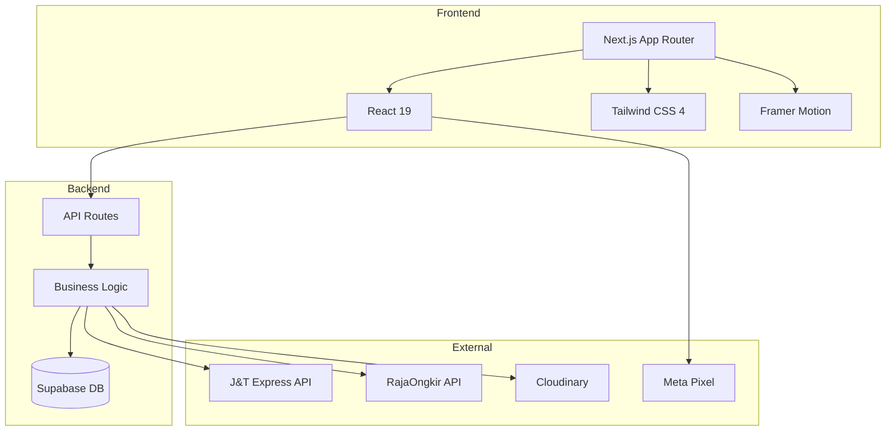

# SAMAQU — E-Commerce Engineering Case Study

## 1. Project Overview

SAMAQU is a production e-commerce platform for a Muslim menswear brand based in Depok, Indonesia. The platform handles the complete commerce lifecycle: product catalog browsing, custom pricing, cart management, checkout with real-time shipping calculation, order processing, and admin fulfillment.

The system is built on Next.js 16 (App Router) with Supabase as the database and authentication layer, integrated with J&T Express and RajaOngkir for shipping, and Cloudinary for media management.

## 2. Business Context

SAMAQU sells Thobe, Kandora, Koko, Vest, Kabak, and garment accessories. The business has specific requirements that differentiate it from typical e-commerce templates:

- **Fabric-first catalog** — Products are organized by fabric type (Jenis Kain), not just category
- **Create Your Price** — Customers can set their own price above a minimum threshold
- **Multi-courier shipping** — Toggle between RajaOngkir (multi-courier) and J&T Express (direct API)
- **Manual payment verification** — Bank transfer, QRIS, and COD with admin verification
- **WhatsApp-first customer service** — Orders and support routed through WhatsApp

## 3. Problem

Building a production e-commerce system for a niche fashion brand requires solving several engineering challenges:

1. **Custom pricing without fraud** — How to let customers name their price while preventing manipulation
2. **Dual shipping providers** — How to integrate both RajaOngkir (aggregator) and J&T Express (direct) with a single checkout flow
3. **Area code translation** — How to map Indonesian administrative regions to J&T's proprietary code system
4. **Stock integrity** — How to prevent overselling during concurrent checkouts
5. **Catalog complexity** — How to represent fabric → series → color → size hierarchies in a flat database

## 4. Solution

The system was built incrementally, with each major feature adding to the existing architecture without requiring rewrites.

### Architecture Decisions

- **Next.js App Router** — Server components for catalog pages, API routes for business logic, client components for interactive checkout
- **Supabase** — Managed PostgreSQL with real-time subscriptions, RLS policies, and RPC functions for atomic operations
- **Server-side validation** — All critical business logic (pricing, stock, shipping) validated on the server, never trusting client data
- **Modular J&T integration** — Separate modules for each API endpoint (tariff, order, cancel, track) with shared config and signature generation

## 5. Product Catalog Architecture

The catalog uses a four-level hierarchy:

```
Category → Jenis Kain → Series → Product/Variant
```

**Category** — Top-level product classification (Thobe, Kandora, Koko, Vest, Kabak, Cover & Hanger)

**Jenis Kain** — Fabric type with structured metadata:
- Material composition
- Texture description
- Suitable for (occasion/use case)
- Care instructions
- Display image

**Series** — Design series within a fabric (e.g., Jiharkah, Imron, Bayati under B-01 fabric)

**Product/Variant** — Individual SKUs defined by color × size combinations

### Database Structure

- `products` — Base product record with category, kain, series, price, CYP fields
- `product_variants` — Color/size combinations with stock levels
- `product_images` — Media items (images/videos) with display order and color association
- `jenis_kain` — Fabric metadata table

### Implementation

The catalog is queried via `lib/db.ts` which joins products with `jenis_kain` and fetches media from `product_images`. Products are grouped by name in the admin panel to show series variations under a single card.

## 6. Create Your Price

Create Your Price (CYP) is the most distinctive feature of the platform. It allows customers to set their own price for eligible products, subject to a minimum price constraint.

### Business Logic

1. Admin enables CYP on a product and sets `minimum_price`
2. Customer sees the product with a price slider (min → recommended → max)
3. Customer selects their price
4. Price is stored as `customer_price` in the cart
5. At checkout, the server fetches `minimum_price` from the database
6. If `customer_price < minimum_price`, the order is rejected
7. The order is persisted with both `customer_price` and `minimum_price` for admin visibility

### Validation Layers

**Client-side (cart-context.tsx:68):**
```typescript
if (item.create_your_price_enabled && item.minimum_price && action.price < item.minimum_price) {
  return state; // reject invalid price
}
```

**Server-side (api/orders/route.ts:64-88):**
```typescript
const { data: product } = await supabase
  .from("products")
  .select("minimum_price, create_your_price_enabled")
  .eq("id", item.productId)
  .single();

if (clientCustomerPrice < dbMinimumPrice) {
  return NextResponse.json({ error: `Harga di bawah minimum` }, { status: 400 });
}
```

The server-side validation is the authoritative check. The client-side check is a UX convenience to prevent immediate rejection.

### Key Insight

CYP creates an interesting trust boundary problem. The customer provides a price, but the server must verify it against the database. This is similar to how shipping costs work — the client sends a value, but the server must decide whether to trust it or revalidate.

For CYP, the answer is clear: always revalidate. For shipping, the decision was to trust the client value (already verified via a separate API call) to avoid consuming RajaOngkir API quota.

## 7. Checkout & Order Management

### Checkout Flow

The checkout page (`app/(customer)/checkout/page.tsx`) handles:

1. **Customer information** — Name, email, WhatsApp number
2. **Shipping address** — Saved addresses (with auto-detection) or manual entry
3. **Shipping method** — Auto-calculated based on address and weight
4. **Payment method** — Bank transfer, QRIS, or COD
5. **Voucher application** — Discount code with validation
6. **Order summary** — Subtotal, shipping, discount, total

### Shipping Calculation

The checkout automatically calculates shipping when an address is selected:

- **RajaOngkir mode** — Resolves destination ID → Calls `/api/shipping/cost` → Returns multi-courier options
- **J&T mode** — Resolves area codes via mapping → Calls `/api/shipping/jnt-cost` → Returns J&T-specific options

Debouncing prevents excessive API calls during address selection (400ms for saved addresses, 1.5s for manual entry).

### Order Creation

The order API (`api/orders/route.ts`) performs:

1. Input validation
2. CYP price validation (fetch from DB)
3. Atomic stock decrement (with rollback on failure)
4. Order insertion
5. Order items insertion
6. Voucher usage tracking
7. J&T order creation (AWB generation)
8. Response with order number and AWB

### Stock Management

Stock is managed via Supabase RPC functions:

- `samaqu_decrement_stock` — Atomic decrement with `FOR UPDATE` row lock
- `samaqu_restore_stock` — Rollback function for failed orders

The flow:
1. Decrement stock for each item
2. If any item fails → rollback all decrements → reject order
3. If all succeed → create order

This prevents the race condition where two customers checkout the last item simultaneously.

## 8. Payment Workflow

SAMAQU uses manual payment verification:

1. Customer selects payment method (Bank Transfer / QRIS / COD)
2. Order is created with `pending` status
3. Customer transfers money and sends proof via WhatsApp
4. Admin verifies payment in dashboard
5. Admin updates order status to `diproses`
6. Shipping is arranged
7. Order status updated to `dikirim` → `selesai`

### Payment Methods

- **Bank Transfer** — Configurable bank accounts (stored in `payment_methods` table)
- **QRIS / E-Wallet** — QR code payment
- **COD** — Cash on delivery (triggers COD flag on J&T order)

## 9. J&T Express Integration

### Integration Architecture

The J&T integration is modular, with separate files for each API endpoint:

```
src/lib/jnt/
├── config.ts      # Environment-based URL + credential resolution
├── signature.ts   # MD5 + Base64 signature generation
├── tariff.ts      # Tariff Check API
├── order.ts       # Order Creation API
├── cancel.ts      # Cancellation API
├── track.ts       # Tracking API
├── area-mapping.ts # 7,128-area code translation
├── area-data.json  # Raw mapping dataset
├── types.ts       # TypeScript interfaces
└── index.ts       # Public exports
```

### Signature Generation

J&T uses a PHP-compatible signature format:

```typescript
// base64(hex(md5(data + key)))
const hexHash = createHash("md5").update(data + key).digest("hex");
return Buffer.from(hexHash).toString("base64");
```

This was a critical debugging point — the signature must match PHP's `base64_encode(md5($data . $key))` exactly.

### Area Mapping

The area mapping system translates between three naming conventions:

1. **Local names** — Indonesian administrative names (Kecamatan, Kota, Provinsi)
2. **J&T city names** — J&T's internal city identifiers
3. **J&T codes** — 3-char origin/destination codes and district area codes

The mapping is built from a CSV dataset with 7,128 rows, indexed at module load time for O(1) lookup.

### Testing vs Production

The system supports both sandbox and production environments via `JNT_ENV`:

- **Testing** — `demo-ecommerce.inuat-jntexpress.id`
- **Production** — `ecommerce.jntexpress.id`

Both environments use the same code path, with only the base URLs changing.

## 10. RajaOngkir Integration

### API Architecture

RajaOngkir V2 (komerce.id) provides:

- **Domestic Cost** — Shipping cost calculation by origin/destination/weight/courier
- **Domestic Destination** — Search for subdistrict IDs by name

### Destination Resolution

The most complex part of the RajaOngkir integration is resolving a customer's address to a numeric destination ID:

1. Check if `district_id` is cached on the saved address
2. Check Supabase `destination_cache` table
3. Call RajaOngkir search API with kecamatan name + city + province
4. Smart matching with 5 priority levels
5. Cache result for future lookups

### Smart Matching Algorithm

```typescript
// Priority 1: exact kecamatan + city + province
// Priority 2: exact kecamatan + city
// Priority 3: partial kecamatan + city
// Priority 4: exact kecamatan name
// Priority 5: first result (fallback)
```

This handles the common case where customers don't know the exact administrative spelling.

### Caching Strategy

Three layers of caching reduce API calls:

1. **Address-level** — `district_id` stored on saved address
2. **Database-level** — `destination_cache` shared across all users
3. **In-memory** — Shipping cost results cached per unique query (10-minute TTL)

## 11. Admin & Business Operations

The admin dashboard is a single-page application with multiple panels:

### Dashboard Panel
- Revenue statistics (excluding pending orders)
- Order count with pending badge
- Top selling products with images
- Recent orders table

### Orders Panel
- Full order list with status filtering
- Order detail modal with status update
- J&T cancellation directly from admin
- CYP price visibility (customer_price vs minimum_price)

### Products Panel
- Product catalog with grouped variants
- CYP toggle and minimum price display
- Series count per product
- Direct edit/delete actions

### Settings Panel
- Store info (name, tagline, contact)
- Shipping origin configuration
- Provider toggle (RajaOngkir vs J&T)
- Courier selection
- API key management
- Payment method configuration
- Social media links
- Meta Pixel configuration

## 12. Security & Validation

### Server-Side Validation Points

| Point | What's Validated |
|-------|-----------------|
| Order creation | CYP price >= minimum_price (fetched from DB) |
| Order creation | Payment method is valid enum |
| Order creation | Required fields present |
| Order creation | Stock sufficient (atomic check) |
| Shipping cost | Calculated server-side (trusted from client after prior verification) |
| Voucher | Active, not expired, not exhausted, min purchase met, per-WA limit |
| Admin orders | Admin role verified against `admins` table |
| J&T integration | Signature generated server-side with API keys |

### Authentication

- **Customer auth** — Supabase Auth with email/password, stored in `customers` table
- **Admin auth** — Supabase Auth with role verification against `admins` table
- **Session isolation** — Sign out before switching between customer/admin

### Environment Protection

- `.env*` files gitignored
- No secrets in repository
- J&T credentials in environment variables
- RajaOngkir key in database (with env fallback)

## 13. Technical Architecture



### Key Technical Decisions

1. **App Router over Pages Router** — Server components reduce client JS, API routes colocated with pages
2. **Supabase over raw PostgreSQL** — Managed hosting, built-in auth, RLS, real-time subscriptions
3. **Client-side cart with server validation** — Cart is fast (localStorage), order is secure (server-validated)
4. **Modular J&T integration** — Each API endpoint is independent, making it easy to test and maintain
5. **Area mapping as static data** — 7,128 rows loaded at startup, O(1) lookup, no external API needed

## 14. Challenges

### Challenge 1: Create Your Price Trust Boundary

**Problem:** Customers can set any price, but the server must enforce minimums.

**Implementation:** Two-layer validation — client-side for UX, server-side for authority. The server fetches `minimum_price` from the database for every CYP item in every order.

**Result:** CYP works seamlessly for customers while preventing price manipulation.

### Challenge 2: Dual Shipping Provider Architecture

**Problem:** The business wants to use RajaOngkir for multi-courier options but J&T Direct API for better rates.

**Implementation:** A `shipping_provider` toggle in store settings switches the checkout flow between RajaOngkir and J&T paths. Both share the same UI but call different API endpoints.

**Result:** Admin can switch providers without code changes.

### Challenge 3: J&T Area Code Translation

**Problem:** J&T uses proprietary city/district codes that don't match Indonesian administrative names.

**Implementation:** A 7,128-row mapping dataset translates between local names and J&T codes. Multiple indexes provide O(1) lookup by district, city, or district+city combination.

**Result:** Customer addresses automatically resolve to J&T codes without manual mapping.

### Challenge 4: Concurrent Checkout Stock Integrity

**Problem:** Two customers buying the last item simultaneously could oversell.

**Implementation:** Atomic stock decrement via Supabase RPC with `FOR UPDATE` row locking. If any item in an order fails validation, all decrements are rolled back.

**Result:** Zero overselling, even under concurrent checkout.

### Challenge 5: Shipping Cost API Quota

**Problem:** RajaOngkir has a daily API call limit (100 hits/day on some plans).

**Implementation:** Shipping cost is calculated once during checkout and sent with the order. The server trusts this value (already verified via a separate API call) to avoid consuming a second API call per order.

**Result:** API quota conserved while maintaining cost accuracy.

### Challenge 6: Destination Resolution Complexity

**Problem:** Customers don't know their RajaOngkir subdistrict ID, and spelling varies.

**Implementation:** Smart matching algorithm with 5 priority levels, plus 3 layers of caching (address, database, in-memory).

**Result:** High match rate with minimal API calls.

## 15. Engineering Decisions

### Why server-side CYP validation?

Client-side validation can be bypassed. The server must be the authority on pricing. Fetching from DB adds a query but prevents revenue loss.

### Why trust client shipping cost?

The shipping cost was already verified via a separate API call during checkout. Revalidating would consume a second API call per order, hitting quota limits. The trust is justified because the value came from our own API response.

### Why atomic stock decrement?

A simple `UPDATE products SET stock = stock - qty WHERE stock >= qty` has a race condition. `FOR UPDATE` row locking ensures only one transaction can modify the stock at a time.

### Why modular J&T integration?

Each J&T API endpoint has different auth mechanisms (signature vs Basic Auth), different data formats, and different error handling. Separating them makes each module independently testable and maintainable.

### Why area mapping as static data?

The 7,128-row dataset is small enough to load at startup. This eliminates an external API dependency for code translation and provides O(1) lookup performance.

### Why localStorage for cart?

Cart is a browsing concern, not a business concern. localStorage provides instant access without server round-trips. The security boundary is at order creation, not cart management.

## 16. Result

The SAMAQU platform is a production e-commerce system that:

- Serves customers with a polished browsing and checkout experience
- Supports a unique "Create Your Price" model with server-side enforcement
- Integrates with two shipping providers through a unified checkout
- Manages 7,128 area code mappings for J&T Express
- Provides administrators with a comprehensive operations dashboard
- Maintains stock integrity through atomic database operations
- Tracks e-commerce events via Meta Pixel with CAPI support
- Supports bilingual (ID/EN) operation

The codebase demonstrates production engineering concerns: trust boundaries, API integration complexity, concurrent access patterns, and business logic validation — all without architectural over-engineering.
