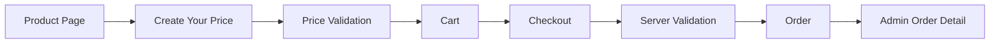
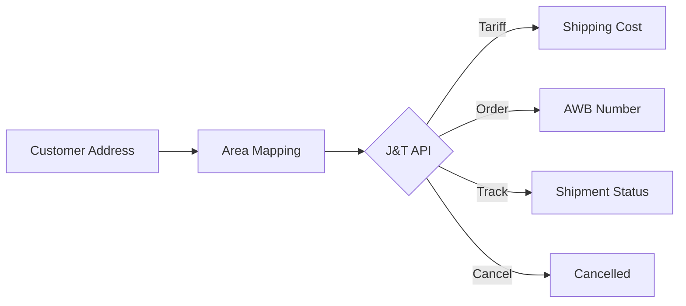
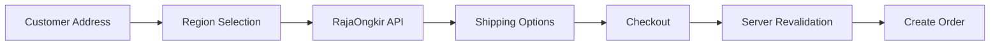
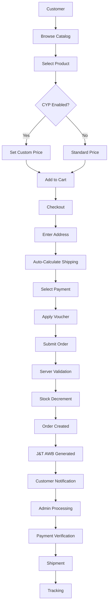
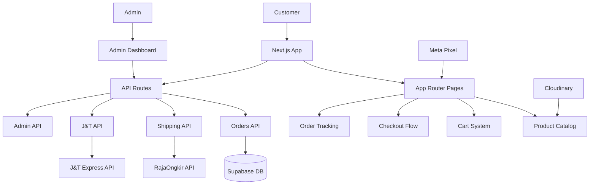

# SAMAQU — E-Commerce & Business System

> Production e-commerce platform for SAMAQU, a Muslim menswear brand specializing in Thobe, Kandora, Koko, Vest, Kabak, and garment accessories.

**Live website:** [https://www.samaqu.id/](https://www.samaqu.id/)

---

## Overview

SAMAQU is a production e-commerce platform built to support product catalog management, custom pricing, checkout, order processing, payment verification, voucher management, and multi-courier shipping integration. The system serves both customers (browse, checkout, track orders) and administrators (manage products, orders, content, and shipping configuration).

## Key Engineering Highlights

- **Hierarchical product catalog** — Category → Jenis Kain → Series → Product/Variant structure with color, size, and fabric attributes
- **Create Your Price (CYP)** — Customer-defined pricing with server-side minimum price validation
- **Custom checkout flow** — Multi-step checkout with saved addresses, real-time shipping calculation, and voucher application
- **Manual payment + proof upload** — Bank transfer, QRIS/E-Wallet, and COD payment methods
- **Order management** — Full order lifecycle from creation to fulfillment with admin status control
- **Voucher system** — Percentage/fixed discounts with usage limits, min purchase, and per-WhatsApp restrictions
- **J&T Express API integration** — Tariff Check, Order Creation, Cancellation, and Tracking with 7,128-area code mapping
- **RajaOngkir API V2 integration** — Shipping cost calculation, destination search, and district-level caching
- **Server-side validation** — CYP price validation, shipping cost verification, and atomic stock decrement with rollback
- **Admin dashboard** — Business operations layer for orders, products, customers, content, vouchers, and shipping configuration
- **Internationalization** — Full ID/EN language support via next-intl
- **Meta Pixel tracking** — E-commerce events (ViewContent, AddToCart, InitiateCheckout, Purchase) with CAPI support

---

## Product Catalog

The catalog uses a hierarchical taxonomy system:

```
Category (Thobe, Kandora, Koko, Vest, Kabak, Cover & Hanger)
  └── Jenis Kain (Fabric Type — B-01, B-02, A-02, C-01, etc.)
        └── Series (Jiharkah, Imron, Bayati, Zahwan, Duha, etc.)
              └── Product / Variant (Color × Size)
```

Each product carries:
- **Category** — Product classification
- **Kain** — Fabric code reference
- **Series** — Design series name
- **Colors** — Available color variants with hex mappings
- **Price** — Base price or minimum price (CYP products)
- **Weight** — Used for shipping cost calculation (grams)
- **Media** — Images and videos per color variant

Products are stored in Supabase with `product_images` and `product_variants` tables for media and stock management. The `jenis_kain` table provides structured fabric metadata (material, texture, care instructions).

---

## Create Your Price

Create Your Price (CYP) is a pricing model where customers can set their own price within a defined range. This is one of the most distinctive engineering features of the platform.

### Flow

```
Product Page (CYP enabled)
  ↓
Customer sees minimum price + recommended range
  ↓
Customer enters custom price via slider/input
  ↓
Client-side validation (price >= minimum_price)
  ↓
Price added to cart as customer_price
  ↓
Price carried through checkout
  ↓
Server-side validation against database minimum_price
  ↓
Order created with customer_price persisted
  ↓
Admin sees custom price on order detail
```

### Implementation

- **Product-level toggle** — `create_your_price_enabled` boolean per product
- **Minimum price** — `minimum_price` field stored in database, never trusted from client
- **Client validation** — Cart rejects prices below minimum (`cart-context.tsx:68`)
- **Server validation** — Order API fetches `minimum_price` from DB and compares (`api/orders/route.ts:64-88`)
- **Order persistence** — `customer_price` and `minimum_price` stored on `order_items` table
- **Admin visibility** — Order detail shows both customer-selected price and minimum price

> Client-provided pricing is validated server-side before being accepted as an order value. The server fetches the minimum price from the database and rejects any order where the customer price falls below it.



---

## Checkout & Order Management

### Checkout Flow

```
Cart / Product Page
  ↓
Customer Information (Name, Email, WhatsApp)
  ↓
Shipping Address (Saved or Manual)
  ↓
Shipping Method (Auto-calculated via RajaOngkir or J&T)
  ↓
Payment Method (Bank Transfer / QRIS / COD)
  ↓
Voucher Application (Optional)
  ↓
Order Submission
  ↓
Server-side Validation (CYP, Stock, Shipping)
  ↓
Order Created + J&T AWB Generated
  ↓
Redirect to Success Page
```

### Order Processing

- **Order number** — Generated as `SMQ-YYYYMMDD-XXX`
- **Payment status** — Manual verification by admin
- **Proof upload** — Customer uploads payment proof via WhatsApp
- **Order status** — `pending` → `diproses` → `dikirim` → `selesai` / `dibatalkan`
- **Stock management** — Atomic decrement via `samaqu_decrement_stock` RPC with `FOR UPDATE` row locking; automatic rollback on any failure
- **Voucher tracking** — Usage count incremented, per-WhatsApp usage recorded

### Stock Validation

Stock is decremented atomically before order creation. If any item fails validation, all decrements are rolled back and the order is rejected. This prevents race conditions when multiple customers checkout simultaneously for the last item.

---

## J&T Express Integration

Full integration with J&T Express API covering the complete shipment lifecycle.

### Tariff Check

Calculates shipping costs using J&T's Tariff Check API. Resolves local city/district names to J&T's internal code system via a 7,128-area mapping dataset.

- **Endpoint:** `POST /api/shipping/jnt-cost`
- **Input:** City name, district name, weight (grams)
- **Output:** Available services with costs
- **Caching:** In-memory cache with 10-minute TTL

### Order API

Creates shipment orders on J&T and retrieves AWB (waybill) numbers.

- **Triggered:** Automatically during order creation (`api/orders/route.ts:244-289`)
- **Input:** Order details, sender/receiver info, package details
- **Output:** AWB number stored on order record
- **Signature:** `base64(hex(md5(data + key)))` — PHP-compatible signature format

### Cancellation API

Cancels J&T shipments from the admin dashboard.

- **Triggered:** Admin clicks "Batalkan di J&T" on order detail
- **Endpoint:** `PATCH /api/admin/orders` with `action: "cancelJnt"`
- **Flow:** Fetch AWB → Call J&T Cancel → Update order status to `dibatalkan`

### Tracking API

Retrieves shipment status from J&T using Basic Auth (different from Order/Tariff which use signature-based auth).

- **Endpoint:** `GET /api/jnt/track`
- **Input:** AWB number
- **Output:** Tracking detail + history

### Area Mapping

A comprehensive mapping system translates local (RajaOngkir-compatible) city/district names to J&T's internal codes:

| Code Type | Purpose | Example |
|-----------|---------|---------|
| `sendSiteCode` | Tariff Check origin | `DEPOK` |
| `code3` | Order origin/destination | `DPK` |
| `destAreaCode` | Tariff Check destination | `DPK001` |
| `receiverArea` | Order receiver area | `DPK001` |

The mapping dataset contains 7,128 area rows with multi-level fallback: exact district+city → district-only → city-only.



---

## RajaOngkir Integration

Integration with RajaOngkir API V2 (komerce.id) for shipping cost calculation and destination resolution.

### Shipping Cost Calculation

- **Endpoint:** `POST /api/shipping/cost`
- **Input:** Origin subdistrict ID, destination subdistrict ID, weight, couriers
- **Output:** Multiple courier options with costs
- **Caching:** In-memory cache with 10-minute TTL
- **Supported couriers:** JNE, SiCepat, J&T, Ninja, Tiki, Wahana, Pos, Lion, Anteraja

### Destination Search

Smart destination resolution with 5-priority matching:

1. Exact kecamatan + city + province
2. Exact kecamatan + city
3. Partial kecamatan + city
4. Exact kecamatan name only
5. First result (fallback)

Results are cached in Supabase `destination_cache` table for future lookups.

### District ID Caching

- **Saved addresses** — `district_id` cached on address record
- **Supabase cache** — `destination_cache` table shared across users
- **In-memory** — Shipping options cached per origin-destination-weight-courier key

> Shipping costs received from the client are not treated as trusted values. The server revalidates shipping information before creating the order.



---

## Admin Dashboard

The admin dashboard serves as the business operations layer, not just a CRUD interface.

### Panels

| Panel | Function |
|-------|----------|
| Dashboard | Revenue stats, pending orders, top products |
| Pesanan | Order list with status filtering, detail modal, J&T cancellation |
| Produk | Product catalog management with grouping, CYP toggle |
| Pelanggan | Customer data aggregated from orders |
| Konten Website | CMS for hero, collection, testimonials |
| Produk Pilihan | Featured products for customer dashboard |
| Pengaturan | Store info, shipping origin, provider toggle, couriers, API keys, payment methods |

### Order Management

- Status updates: `pending` → `diproses` → `selesai` / `dibatalkan`
- J&T cancellation directly from admin
- Order detail shows CYP prices (customer_price vs minimum_price)
- Voucher usage tracking

### Shipping Configuration

- **Provider toggle** — Switch between RajaOngkir and J&T Direct API
- **Origin setting** — Configure store's subdistrict for shipping calculation
- **Courier selection** — Enable/disable specific couriers
- **API key management** — RajaOngkir API key stored in database (not environment)

---

## Business Process



---

## Architecture



### Layers

| Layer | Description |
|-------|-------------|
| **Presentation** | Next.js App Router with React 19, Tailwind CSS, Framer Motion |
| **Application** | Server-side API routes handling business logic |
| **Data** | Supabase (PostgreSQL) with RLS policies |
| **External** | J&T Express API, RajaOngkir API, Cloudinary, Meta Pixel |
| **Auth** | Supabase Auth with admin/customer role separation |

---

## Security Considerations

- **Server-side CYP validation** — Minimum price fetched from database, never trusted from client
- **Server-side shipping validation** — Shipping cost verified via API before order creation
- **Atomic stock management** — `FOR UPDATE` row locking with automatic rollback on failure
- **Admin role verification** — Admin access checked against `admins` table with role field
- **API key isolation** — J&T credentials in environment variables, RajaOngkir key in database
- **Session separation** — Admin and customer auth sessions are isolated (sign out before switching)
- **Input validation** — Phone number regex, required field checks, payment method whitelist
- **Environment protection** — `.env*` files gitignored, no secrets in repository

---

## Tech Stack

| Layer | Technology |
|-------|------------|
| Framework | Next.js 16 (App Router) |
| Frontend | React 19, Tailwind CSS 4, Framer Motion |
| UI Components | Radix UI, Ark UI, Base UI, Lucide Icons |
| Database | Supabase (PostgreSQL) |
| Authentication | Supabase Auth |
| Image/Video | Cloudinary |
| Payment | Bank Transfer, QRIS/E-Wallet, COD (Manual) |
| Shipping | J&T Express API, RajaOngkir API V2 |
| Analytics | Meta Pixel + CAPI |
| Internationalization | next-intl (ID/EN) |
| Deployment | Vercel |
| Barcode | JsBarcode |

---

## Project Structure

```
.
├── src/
│   ├── app/
│   │   ├── (customer)/          # Customer-facing pages
│   │   │   ├── cart/            # Shopping cart
│   │   │   ├── checkout/        # Checkout flow
│   │   │   ├── create-your-price/  # CYP landing page
│   │   │   ├── katalog/         # Product catalog
│   │   │   └── ...
│   │   ├── admin/               # Admin dashboard
│   │   ├── api/                 # API routes
│   │   │   ├── admin/           # Admin APIs (orders, bio-links)
│   │   │   ├── jnt/             # J&T integration endpoints
│   │   │   ├── orders/          # Order creation
│   │   │   ├── shipping/        # Shipping calculation
│   │   │   └── ...
│   │   └── layout.tsx           # Root layout with SEO
│   ├── components/              # Reusable UI components
│   │   ├── CreateYourPrice.tsx  # CYP hero section
│   │   ├── Dashboard/           # Customer dashboard
│   │   ├── ui/                  # Base UI components
│   │   └── ...
│   ├── hooks/                   # Custom React hooks
│   ├── i18n/                    # Internationalization config
│   ├── lib/                     # Business logic & integrations
│   │   ├── jnt/                 # J&T Express API module
│   │   │   ├── area-mapping.ts  # 7,128-area code mapping
│   │   │   ├── tariff.ts        # Tariff Check API
│   │   │   ├── order.ts         # Order Creation API
│   │   │   ├── cancel.ts        # Cancellation API
│   │   │   ├── track.ts         # Tracking API
│   │   │   ├── signature.ts     # MD5+Base64 signature
│   │   │   └── config.ts        # Environment config
│   │   ├── cart-context.tsx     # Cart state management
│   │   ├── shipping-utils.ts    # RajaOngkir integration
│   │   ├── voucher-utils.ts     # Voucher validation
│   │   ├── db.ts                # Database queries
│   │   └── ...
│   └── middleware.ts             # i18n routing middleware
├── supabase/                    # SQL migrations & schema
│   ├── schema.sql               # Base schema
│   ├── create-your-price.sql    # CYP migration
│   └── ...                      # Feature-specific migrations
├── public/                      # Static assets
│   ├── fonts/                   # Custom fonts
│   ├── images/                  # Product images
│   └── products/                # Product media
├── package.json
└── README.md
```

---

## Environment Variables

```env
# Supabase
NEXT_PUBLIC_SUPABASE_URL=
NEXT_PUBLIC_SUPABASE_ANON_KEY=
SUPABASE_SERVICE_ROLE_KEY=

# J&T Express
JNT_ENV=testing|production
JNT_ORDER_USERNAME=
JNT_ORDER_API_KEY=
JNT_ORDER_KEY=
JNT_TARIFF_KEY=
JNT_TARIFF_CUS_NAME=
JNT_TRACK_USERNAME=
JNT_TRACK_PASSWORD=
JNT_COMPANY_ID=

# RajaOngkir (stored in database, env as fallback)
RAJAONGKIR_API_KEY=

# Cloudinary
NEXT_PUBLIC_CLOUDINARY_CLOUD=
NEXT_PUBLIC_CLOUDINARY_PRESET=

# Meta Pixel
NEXT_PUBLIC_META_PIXEL_ID=
META_ACCESS_TOKEN=
META_TEST_EVENT_CODE=

# App
NEXT_PUBLIC_SITE_URL=
```

---

## Development Highlights

| Milestone | Description |
|-----------|-------------|
| Initial architecture | Next.js App Router + Supabase + Tailwind CSS setup |
| Product catalog | Hierarchical Category → Kain → Series → Variant structure |
| Create Your Price | Custom pricing model with client + server validation |
| Checkout system | Multi-step checkout with saved addresses |
| J&T Express integration | Tariff, Order, Cancel, Track APIs with area mapping |
| RajaOngkir integration | Shipping cost calculation with destination caching |
| Admin dashboard | Full business operations panel |
| Voucher system | Discount codes with usage limits |
| Internationalization | Full ID/EN language support |
| Meta Pixel | E-commerce event tracking with CAPI |

---

## License

Private — SAMAQU Business System
